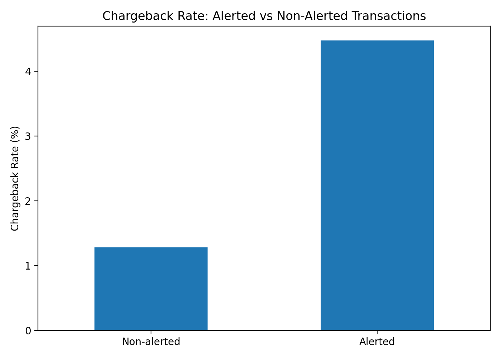
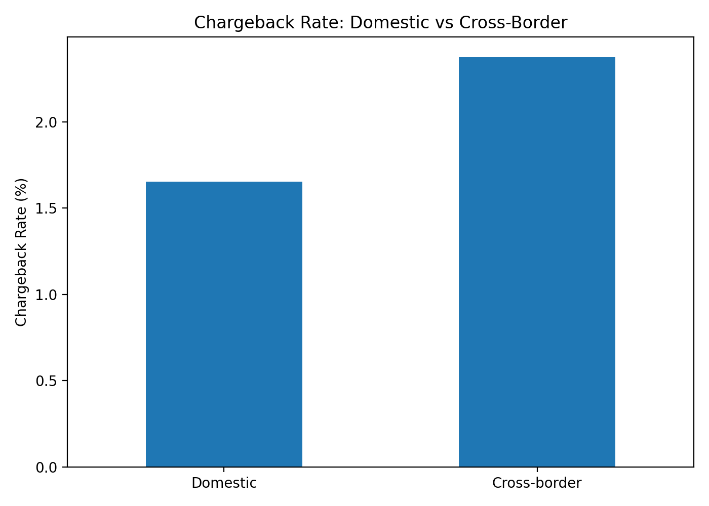
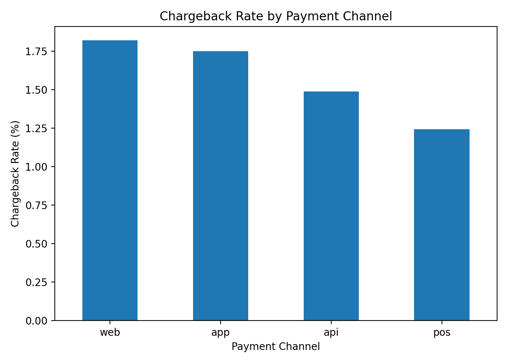
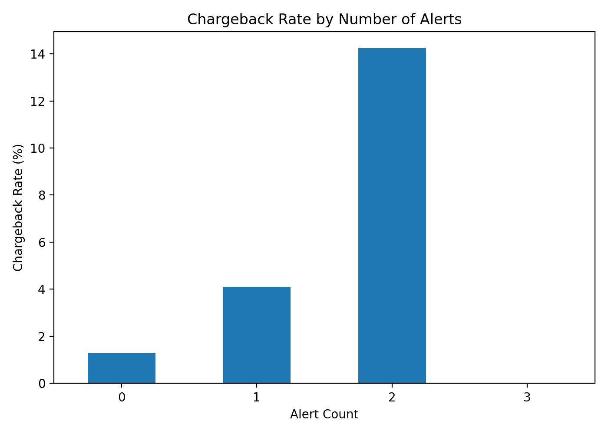

# Finance & Fraud Analytics Pipeline

An end-to-end finance and fraud analytics project built using PostgreSQL, SQL, Python, pandas, Matplotlib and Tableau.

The project simulates a financial transaction environment containing approximately 56,000 transactions across 5,000 customers and 400 merchants. It demonstrates how transactional data can be structured, validated, transformed and analysed to identify payment failures, chargeback exposure and suspicious activity.

The pipeline covers the full analytical workflow:

**Synthetic Data → PostgreSQL Core Tables → Data Validation & Risk Rules → SQL Analytical Marts → Python Analysis → Tableau Dashboards → Business Insights**

The project includes rule-based fraud alerts, payment and chargeback analytics, five interactive Tableau dashboards, Python-based data-quality and exploratory analysis, and recruiter-friendly analytical outputs.


> **Note:** This project uses synthetic data and is intended for portfolio and analytical demonstration purposes. It does not represent a production fraud-detection system or real customer/banking data.

## Business Problem

Financial transaction platforms generate large volumes of payment activity, but identifying meaningful risk patterns requires more than simply storing transaction records.

The project was designed to answer practical analytical questions such as:

- Which payment failures occur most frequently?
- Which transaction channels and payment methods show higher failure or chargeback exposure?
- Are cross-border transactions associated with greater downstream risk?
- Do transactions flagged by fraud rules show higher chargeback rates?
- Which fraud rules generate the highest-risk alerts?
- How can transaction, chargeback and alert data be transformed into clear reporting for business and risk teams?

The objective was to build an end-to-end analytics workflow that could structure transactional data, apply explainable fraud-risk rules, validate data quality, create reusable analytical datasets and communicate findings through SQL, Python and Tableau.


## Dataset & Scale

The project uses a fully synthetic financial transaction dataset designed to simulate realistic payment, customer, merchant, device, fraud-alert and chargeback activity.

Current project scale:

- **56,691 transactions**
- **5,000 customers**
- **400 merchants**
- **969 chargebacks**
- **7,936 fraud/risk alerts**

Transaction activity includes:

- Purchases
- Refunds
- Transfers
- Withdrawals

Payment activity is distributed across:

- App
- Web
- POS
- API

Payment methods include:

- Card
- Wallet
- Bank transfer
- Account balance

The synthetic design makes it possible to test data-quality rules, transaction-risk logic, chargeback analysis and dashboard reporting without using any real banking or customer data.

## Tech Stack

| Technology | Role in the Project |
|---|---|
| **PostgreSQL** | Relational database for storing customers, accounts, merchants, devices, transactions, chargebacks and fraud alerts |
| **SQL** | Schema design, data generation, validation, fraud-risk rules, joins, aggregations and analytical marts |
| **Python** | Data-quality checks, exploratory data analysis and fraud/chargeback analysis |
| **pandas** | Data manipulation, aggregation and analytical calculations |
| **Matplotlib** | Python-based analytical visualisations |
| **Tableau** | Interactive dashboards for transaction, payment failure, chargeback and risk reporting |
| **Git & GitHub** | Version control, project documentation and portfolio presentation |

## Pipeline Architecture

The project follows an end-to-end analytics pipeline:

**Synthetic Data Generation → PostgreSQL Core Tables → Data Validation → Fraud/Risk Rules → Analytical Marts → Python Analysis → Tableau Dashboards → Business Insights**

### Pipeline Flow

1. **Synthetic data generation**
   - Created realistic customer, merchant, device, account, transaction, chargeback and alert data.

2. **Core data storage**
   - Loaded structured data into PostgreSQL schemas and relational tables.

3. **Data validation**
   - Checked transaction quality, missing values, duplicates and business-rule consistency.

4. **Fraud and risk logic**
   - Applied explainable rule-based alerts for suspicious transaction patterns.

5. **Analytical marts**
   - Built reusable SQL summary tables for payment failures, chargebacks, suspicious activity and country/customer risk.

6. **Python analysis**
   - Performed data-quality checks, exploratory analysis, chargeback analysis and risk comparisons using pandas.

7. **Tableau reporting**
   - Built five dashboards for executive monitoring, payment failures, chargebacks, suspicious activity and country risk.

8. **Business interpretation**
   - Converted technical outputs into risk and payment insights suitable for business and analytics teams.
  
## Database Design

The PostgreSQL database is organised into separate schemas to distinguish operational-style data, risk logic and analytical reporting.

### Core Schema

The `core` schema contains the main entities used throughout the project:

- **customers** — customer profile, country, KYC and account-status information
- **accounts** — financial accounts associated with customers
- **merchants** — merchant information used for transaction and risk analysis
- **devices** — device information including attributes used in device-risk detection
- **customer_devices** — mapping between customers and devices
- **transactions** — central transaction-level fact table containing amount, status, payment channel, payment method, country and cross-border indicators
- **chargebacks** — chargeback events linked back to transactions, customers and merchants

### Risk Schema

The `risk` schema contains generated fraud/risk alerts.

The `risk.alerts` table records information such as:

- Alert rule
- Alert severity
- Risk score
- Related transaction, customer or device

A single transaction can trigger multiple risk alerts. During Python analysis, alerts were therefore aggregated to **transaction grain** before joining them with transaction and chargeback data to prevent duplicate transaction counts.

### Mart Schema

The `mart` schema contains SQL-generated analytical datasets designed for reporting and downstream analysis.

This separation creates a clear flow between:

**Core Transaction Data → Risk Logic → Analytical Marts → Python / Tableau**

## Fraud & Risk Rules

The project implements explainable rule-based risk detection rather than treating fraud identification as a black-box process.

Four risk rules were implemented:

### 1. High-Value Transaction
Flags transactions that exceed the defined high-value threshold.

### 2. Emulator Device Usage
Flags activity associated with devices identified as emulator environments, providing a device-level risk signal.

### 3. Cross-Border High-Risk Merchant
Identifies cross-border transactions involving merchants that meet the project's higher-risk criteria.

### 4. Multiple Chargebacks Customer
Flags customers with repeated chargeback activity to identify potentially higher-risk behavioural patterns.

Each generated alert contains supporting information such as the rule triggered, severity and risk score.

The current dataset contains **7,936 alert records** across **7,641 unique alerted transactions**. Because a transaction can trigger more than one rule, alert records and alerted transactions are intentionally treated as different measures.

This explainable rule layer allows suspicious activity to be traced back to the specific condition that generated the alert.

## SQL Analytical Marts

To support reporting and downstream analysis, the project includes reusable SQL marts built from the core transaction and risk data.

The marts summarise operational and risk activity at reporting-friendly grains so that Tableau and analytical workflows do not need to repeatedly query raw transaction-level tables.

### Daily Transaction Summary

Summarises daily transaction activity including:

- Transaction counts
- Transaction values
- Approval and failure rates
- Cross-border activity
- Status-level performance

### Payment Failure Summary

Provides reporting on failed payments by date and failure reason, including:

- Failed transaction count
- Failed transaction amount
- Affected customers
- Affected merchants
- Cross-border failure rate

### Chargeback Summary

Summarises chargeback activity for reporting and loss-exposure analysis, including:

- Chargeback counts
- Chargeback values
- Chargeback reasons
- Chargeback status

### Suspicious Activity Summary

Aggregates fraud/risk alerts by date and rule, including:

- Alert counts
- Distinct entities
- Distinct transactions
- Severity breakdowns
- Risk-score statistics

### Country Risk Summary

Provides country-level transaction and risk indicators, including:

- Transaction volumes
- Approval rates
- Failure rates
- Cross-border activity
- Chargeback exposure

### Customer Risk Profile

Creates a customer-level analytical view combining transaction and risk behaviour to support customer risk analysis.

These marts form the reporting layer between the raw/core database tables and the Tableau dashboards.

## Tableau Dashboards

Five Tableau dashboards were developed to present transaction, payment, chargeback and risk insights in a business-friendly format.

### 1. Executive Overview

Provides a high-level view of overall transaction and risk performance, including:

- Daily transaction amount trend
- Daily transaction volume
- Alerts by rule
- Chargeback rate by country
- Chargebacks by reason


### 2. Payment Failure Analysis

Focuses on payment failure behaviour and operational impact, including:

- Daily failure trend
- Failure count by reason
- Failed amount by reason
- Affected customers
- Affected merchants


### 3. Chargebacks & Loss Exposure

Tracks chargeback activity and exposure through:

- Daily chargeback trend
- Chargebacks by reason
- Chargeback amount by reason
- Chargeback status mix


### 4. Suspicious Activity & Alerts

Provides visibility into fraud/risk alerts, including:

- Alert trend
- Alerts by rule
- Average risk score by rule
- Distinct entities by rule


### 5. Country Risk Analysis

Compares transaction and risk behaviour across countries, including transaction activity, failure exposure, cross-border behaviour and chargeback-related indicators.


## Python Analysis

Python was added to extend the SQL and Tableau workflow with programmatic data-quality validation, exploratory analysis and transaction-level fraud/chargeback investigation.

### Data Quality Validation

Using pandas and PostgreSQL data, the transaction dataset was validated before analysis.

Key checks included:

- Missing-value analysis
- Duplicate-row detection
- Invalid or non-positive transaction amounts
- Transaction status distributions
- Transaction-type distributions
- Failed transactions without failure reasons
- Non-failed transactions incorrectly containing failure reasons
- Cross-border transaction distribution
- Payment channel and payment method distributions

The validation identified:

- **56,691 transaction records**
- **0 duplicate rows**
- **0 invalid/non-positive transaction amounts**
- **0 failed transactions without a failure reason**
- **0 non-failed transactions incorrectly containing a failure reason**

The 50,373 missing `failure_reason` values were expected because failure reasons are only populated for the 6,318 failed transactions.

### Exploratory Data Analysis

EDA was performed to investigate:

- Transaction amounts by status
- Payment failure rates by channel
- Payment failure rates by payment method
- Domestic vs cross-border activity
- Failure reasons and failed transaction values

The analysis showed that payment failures were primarily associated with operational/payment reasons such as insufficient funds and issuer declines rather than suspected-fraud declines.

### Fraud & Chargeback Analysis

Transaction data was combined with chargeback and fraud-alert information to investigate whether risk signals were associated with downstream chargeback exposure.

Analysis included:

- Overall chargeback rate
- Alerted vs non-alerted chargeback rates
- Domestic vs cross-border chargeback rates
- Chargeback rates by payment channel
- Number of alerts triggered per transaction
- Risk-score distributions

### Handling a One-to-Many Join Issue

During the analysis, an initial join between transactions and alerts increased the dataset from **56,691 to 56,986 rows**.

Investigation showed that individual transactions could trigger multiple fraud alerts. Joining the alert table directly therefore duplicated some transaction records and inflated downstream chargeback calculations.

The issue was corrected by aggregating alerts to **one row per transaction before joining**.

After correction:

- Transaction rows returned to **56,691**
- Chargebacks corrected from **1,009 to 969**
- Overall chargeback rate corrected from **1.77% to 1.71%**
- Unique alerted transactions were correctly identified as **7,641**

This ensured that each transaction contributed only once to transaction-level chargeback calculations.

## Python Visual Outputs

Python visualisations were created using Matplotlib to communicate the main chargeback and risk findings from the transaction-level analysis.

### Alerted vs Non-Alerted Transactions

Transactions flagged by one or more risk rules showed a substantially higher chargeback rate than non-alerted transactions.



### Domestic vs Cross-Border Transactions

Cross-border transactions showed higher chargeback exposure than domestic transactions.



### Chargeback Rate by Payment Channel

Chargeback rates were compared across web, app, API and POS transaction channels.



### Chargeback Rate by Number of Alerts

The analysis also compared chargeback rates according to how many alert rules were triggered for a transaction.



> Transactions with three alerts were very rare in the current synthetic dataset, so that category should not be interpreted as a reliable risk pattern.

## Key Findings

The final corrected transaction-level analysis produced the following results:

- **Overall chargeback rate:** 1.71%
- **Alerted transaction chargeback rate:** 4.48%
- **Non-alerted transaction chargeback rate:** 1.28%
- **Cross-border chargeback rate:** 2.37%
- **Domestic chargeback rate:** 1.65%
- **Web chargeback rate:** 1.82%
- **App chargeback rate:** 1.75%
- **API chargeback rate:** 1.49%
- **POS chargeback rate:** 1.24%

The strongest result was the difference between alerted and non-alerted activity. Transactions flagged by the rule-based risk system had approximately **3.5 times the chargeback rate** of non-alerted transactions.

Another useful finding was that cross-border transactions did not show a higher payment-failure rate during the earlier EDA, but they did show higher downstream chargeback exposure. This demonstrates the importance of analysing payment failures and chargeback risk as separate outcomes.

The analysis also indicated that transactions triggering multiple alert rules may represent higher-risk activity, although smaller multi-alert sample sizes mean these results should be interpreted cautiously.

## Repository Structure

~~~text
finance-fraud-analytics-pipeline/
│
├── ddl/
│   └── PostgreSQL schema and table creation scripts
│
├── seed/
│   └── Synthetic data generation and population scripts
│
├── marts/
│   └── SQL analytical marts for transaction, payment, chargeback and risk reporting
│
├── dashboard/
│   ├── Tableau workbook files
│   ├── Executive overview.png
│   ├── Payment failure.png
│   ├── Chargeback and loss exposure.png
│   ├── Suspicious Activity and Alert.png
│   └── Country risk.png
│
├── python/
│   ├── 01 data quality.py
│   ├── 02 eda.py
│   ├── 03 fraud analysis.py
│   └── 04 visual analysis.py
│
├── outputs/
│   ├── analysis_summary.csv
│   ├── alerted_vs_non_alerted.png
│   ├── cross_border_chargeback_rate.png
│   ├── payment_channel_chargeback_rate.png
│   └── chargeback_rate_by_alert_count.png
│
├── .gitignore
└── README.md
~~~
## How to Run the Project

### 1. Clone the Repository

```bash
git clone https://github.com/Damaranath/finance-fraud-analytics-pipeline.git
cd finance-fraud-analytics-pipeline
```

### 2. Set Up PostgreSQL

Create a PostgreSQL database named:

```text
finance_fraud
```

Run the SQL scripts in this order:

1. `ddl/` — create schemas and core tables
2. `seed/` — generate and load synthetic data
3. `marts/` — create analytical reporting marts

### 3. Create a Python Virtual Environment

```bash
python3 -m venv .venv
source .venv/bin/activate
```

Install the required packages:

```bash
pip install pandas numpy psycopg2-binary matplotlib python-dotenv
```

### 4. Configure Database Credentials

Create a `.env` file in the project root:

```text
DB_HOST=localhost
DB_NAME=finance_fraud
DB_USER=postgres
DB_PASSWORD=your_password
```

The `.env` file is excluded from version control through `.gitignore` and should never be committed to GitHub.

### 5. Run the Python Analysis

```bash
python python/01_data_quality.py
python python/02_eda.py
python python/03_fraud_analysis.py
python python/04_visual_analysis.py
```

The final script generates the analytical charts and summary outputs inside the `outputs/` folder.

### 6. Tableau

The Tableau workbook files and exported dashboard images are available in the `dashboard/` folder.

The dashboards were developed using PostgreSQL as the analytical data source and the SQL marts created in the project.

## Limitations

This project is designed as a portfolio analytics project and has several important limitations:

- The dataset is fully synthetic and does not contain real banking, merchant or customer data.
- Fraud alerts are generated using explainable rule-based logic rather than a production fraud-detection model.
- Chargebacks are used as a downstream risk outcome, but a chargeback does not necessarily represent confirmed fraud.
- Some smaller analytical groups, particularly transactions triggering multiple alerts, contain limited observations and should be interpreted cautiously.
- The pipeline currently runs locally and does not include production orchestration, real-time streaming or automated cloud deployment.

## Future Improvements

Potential extensions include:

- Develop and evaluate a baseline machine-learning model for transaction risk while carefully preventing target leakage.
- Add richer customer, merchant, device and behavioural features for risk modelling.
- Introduce time-based validation to better simulate how fraud models would be evaluated in a real operational environment.
- Add NLP analysis for unstructured information such as dispute narratives, customer-support messages or reviews.
- Explore LLM-assisted summarisation and classification of unstructured fraud evidence for investigator support.
- Automate pipeline execution using workflow orchestration and scheduled data-quality checks.
- Explore cloud deployment and scalable data-processing architecture.

The structured fraud-analysis layer would remain based on SQL, Python and statistical/machine-learning methods, while NLP/LLM capabilities would be used only where unstructured data provides a meaningful use case.

## Author

**Damaranath Kokkula**  
Master of Data Science — Macquarie University

- GitHub: [github.com/Damaranath](https://github.com/Damaranath)
- LinkedIn: [linkedin.com/in/damaranath-kokkula-6919b1325](https://www.linkedin.com/in/damaranath-kokkula-6919b1325/)

---

*This project was developed independently as a portfolio project to demonstrate end-to-end data analytics, SQL, PostgreSQL, Python, fraud/risk analysis, Tableau visualisation and analytical problem-solving skills.*


